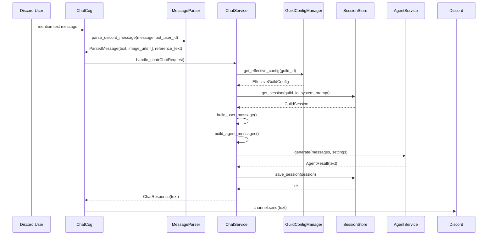
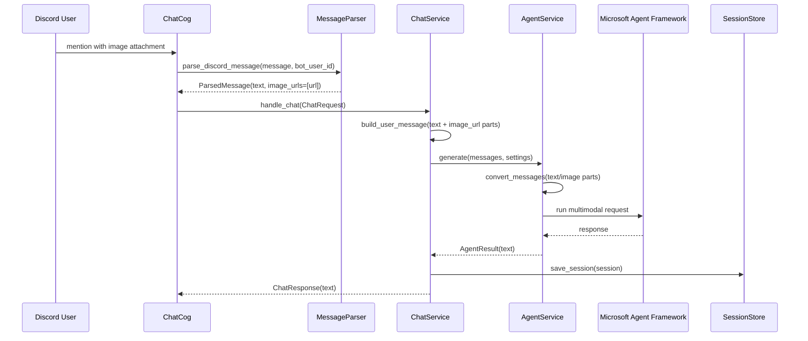
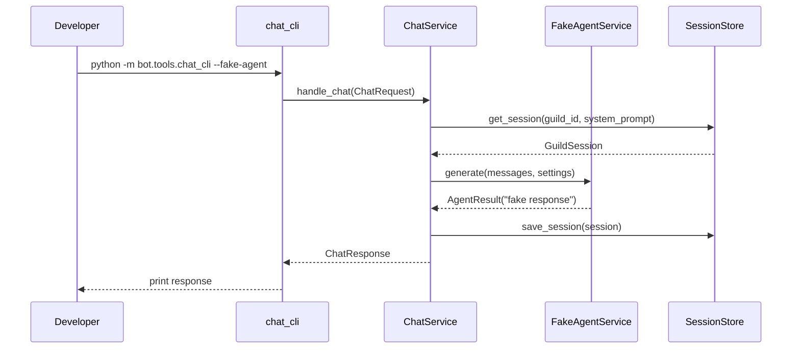
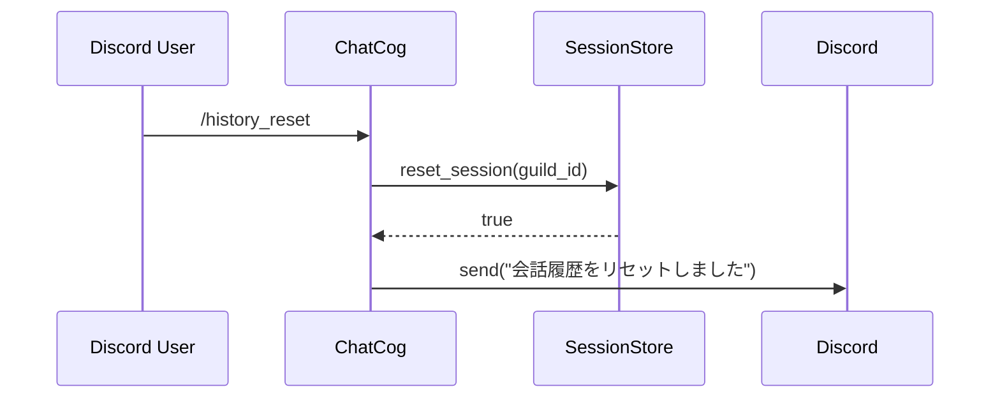
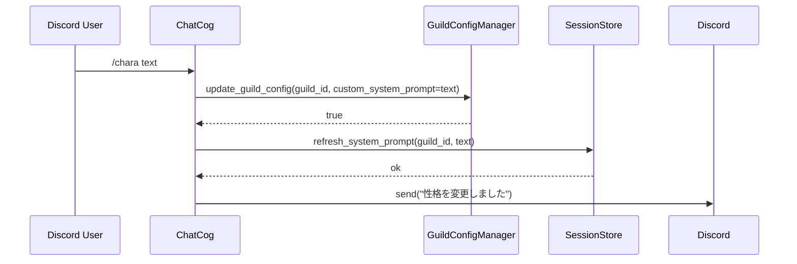

# モジュール・関数詳細設計

## 1. 目的

Microsoft Agent Framework への最小移行を実装する前に、各モジュールと主要関数の責務、In/Out、処理順序、エラー方針を定義する。

対象は初期移行スコープである。

- テキスト / 画像チャット
- 設定・ログ永続化
- Guild 毎セッション分離
- ローカルテスト容易性

MCP、Web 検索、Riot API レビュー、履歴要約は初期実装対象外。ただし履歴要約と MCP は後続で差し込める境界を残す。

## 2. 全体構成

```text
bot/
  main.py
  cogs/
    chat.py
  modules/
    agent_service.py
    chat_models.py
    chat_service.py
    config.py
    guild_config.py
    logging_service.py
    message_parser.py
    session_store.py
  tools/
    chat_cli.py
```

## 3. データモデル

### 3.1 `ChatContentPart`

場所: `bot/modules/chat_models.py`

| 項目 | 型 | 必須 | 説明 |
| --- | --- | --- | --- |
| `type` | `Literal["text", "image_url"]` | yes | content 種別 |
| `text` | `str | None` | no | `type == "text"` の本文 |
| `image_url` | `str | None` | no | `type == "image_url"` の画像 URL |
| `detail` | `str | None` | no | 画像解像度。`low` / `high` |

制約:

- `type == "text"` の場合は `text` を持つ。
- `type == "image_url"` の場合は `image_url` を持つ。
- 初期実装では画像バイナリは保持しない。

### 3.2 `ChatMessage`

場所: `bot/modules/chat_models.py`

| 項目 | 型 | 必須 | 説明 |
| --- | --- | --- | --- |
| `role` | `Literal["system", "user", "assistant"]` | yes | 発話者 |
| `content` | `list[ChatContentPart]` | yes | message body |
| `created_at` | `datetime` | yes | 作成日時 |

制約:

- `assistant` は原則 `text` part 1件。
- `system` は session 属性として扱うため、永続化履歴には通常保存しない。

### 3.3 `GuildSession`

場所: `bot/modules/chat_models.py`

| 項目 | 型 | 必須 | 説明 |
| --- | --- | --- | --- |
| `guild_id` | `int` | yes | Discord Guild ID |
| `system_prompt` | `str` | yes | 有効な system prompt |
| `messages` | `list[ChatMessage]` | yes | user / assistant 履歴 |
| `updated_at` | `datetime` | yes | 最終更新日時 |

後続拡張:

- 履歴要約追加時に `summary: str | None` を追加する。

### 3.4 `ChatRequest`

場所: `bot/modules/chat_models.py`

| 項目 | 型 | 必須 | 説明 |
| --- | --- | --- | --- |
| `guild_id` | `int` | yes | Discord Guild ID |
| `user_id` | `int` | yes | Discord User ID |
| `text` | `str` | yes | mention 除去後の本文 |
| `image_urls` | `list[str]` | yes | 添付画像 / 本文中画像 URL |
| `reference_text` | `str | None` | no | 返信先メッセージ本文 |

### 3.5 `ChatResponse`

場所: `bot/modules/chat_models.py`

| 項目 | 型 | 必須 | 説明 |
| --- | --- | --- | --- |
| `text` | `str` | yes | Discord に返す本文 |
| `guild_id` | `int` | yes | 対象 Guild |
| `message_count` | `int` | yes | 保存後の履歴件数 |

### 3.6 `AgentSettings`

場所: `bot/modules/agent_service.py`

| 項目 | 型 | 必須 | 説明 |
| --- | --- | --- | --- |
| `provider` | `str` | yes | 初期値は `openai` |
| `model` | `str` | yes | 使用モデル |
| `temperature` | `float` | yes | 生成温度 |
| `max_tokens` | `int` | yes | 最大出力 token |
| `image_detail` | `str` | yes | `low` / `high` |

### 3.7 `AgentResult`

場所: `bot/modules/agent_service.py`

| 項目 | 型 | 必須 | 説明 |
| --- | --- | --- | --- |
| `text` | `str` | yes | Agent 応答本文 |
| `raw` | `Any | None` | no | debug 用 raw response。永続化しない |

## 4. モジュール別設計

## 4.1 `bot/main.py`

### 責務

- logger 初期化。
- `AppConfig` 読み込み。
- Discord Bot 起動。
- 初期移行対象 Cog のみ読み込み。
- Guild command sync。

### `main()`

| In | Out |
| --- | --- |
| 環境変数 `DISCORD_BOT_TOKEN`, `GUILD_ID`, `BOT_PREFIX` | Bot process |

処理:

1. `setup_logging()` を呼ぶ。
2. `AppConfig.load()` を呼ぶ。
3. Discord intents を設定する。
4. Cog allowlist に従い `cogs.chat` のみ読み込む。
5. Guild command sync を行う。
6. Bot を起動する。

エラー:

- token 未設定なら起動前に `RuntimeError`。
- `GUILD_ID` 未設定なら Discord Bot 起動時は `RuntimeError`。
- config load 失敗時は error log を出して終了。

## 4.2 `bot/cogs/chat.py`

### 責務

- Discord の event / command を受ける。
- Discord message を `ChatRequest` へ変換する。
- `ChatService` を呼び出す。
- Discord へ返信する。

### `ChatCog.__init__(bot)`

| In | Out |
| --- | --- |
| `commands.Bot` | `ChatCog` |

依存:

- `AppConfig`
- `GuildConfigManager`
- `SessionStore`
- `AgentService`
- `ChatService`
- `MessageParser`

### `on_message(message)`

| In | Out |
| --- | --- |
| `discord.Message` | Discord channel response |

処理:

1. Bot 自身の message は無視する。
2. Bot mention がない message は無視する。
3. `MessageParser.parse_discord_message()` で `ParsedMessage` を作る。
4. `ChatRequest` を作る。
5. `ChatService.handle_chat()` を呼ぶ。
6. `message.channel.send(response.text)` を呼ぶ。

エラー:

- parser validation error はユーザー向け文言で返信。
- agent / store error は generic error で返信し、詳細は log。

### `/history`

| In | Out |
| --- | --- |
| `ctx.guild.id` | Discord embed/text |

処理:

1. `SessionStore.get_session(guild_id)` を呼ぶ。
2. user / assistant 履歴を短縮表示する。

### `/history_reset`

| In | Out |
| --- | --- |
| `ctx.guild.id` | 成功/失敗 message |

処理:

1. `SessionStore.reset_session(guild_id)` を呼ぶ。
2. 成功 message を返す。

### `/chara text`

| In | Out |
| --- | --- |
| `ctx.guild.id`, `text` | 成功/失敗 message |

処理:

1. `GuildConfigManager.update_guild_config(custom_system_prompt=text)` を呼ぶ。
2. `SessionStore.refresh_system_prompt(guild_id, text)` を呼ぶ。

### `/chara_reset`

| In | Out |
| --- | --- |
| `ctx.guild.id` | 成功/失敗 message |

処理:

1. Guild custom prompt を削除する。
2. default system prompt を session に反映する。

### `/config`

| In | Out |
| --- | --- |
| `ctx.guild.id` | Discord embed/text |

表示項目:

- provider
- model
- max_tokens
- temperature
- image_detail
- history_size
- custom system prompt の有無

### `/config_set_model provider model`

| In | Out |
| --- | --- |
| `ctx.guild.id`, `provider`, `model` | 成功/失敗 message |

制約:

- 初期実装では provider は `openai` のみ許可してよい。
- 未対応 provider は validation error。
- `/search` は登録しない。

## 4.3 `bot/modules/message_parser.py`

### 責務

- Discord message からアプリ入力に必要な情報だけ抽出する。
- mention 除去、返信参照、画像 URL 抽出を行う。
- Agent / Session には依存しない。

### `ParsedMessage`

| 項目 | 型 | 説明 |
| --- | --- | --- |
| `text` | `str` | mention と画像 URL を除去した本文 |
| `image_urls` | `list[str]` | 入力画像 URL |
| `reference_text` | `str | None` | 返信先本文 |

### `parse_discord_message(message, bot_user_id) -> ParsedMessage`

| In | Out |
| --- | --- |
| `discord.Message`, `bot_user_id: int` | `ParsedMessage` |

処理:

1. mention `<@id>` / `<@!id>` を除去する。
2. `message.reference.resolved.content` があれば取得する。
3. `message.attachments` から画像 URL を抽出する。
4. 本文中 URL から画像 URL を抽出する。
5. 本文から画像 URL を取り除く。
6. `ParsedMessage` を返す。

エラー:

- 未対応拡張子の attachment は `MessageValidationError`。
- text も image もない場合は `MessageValidationError`。

### `extract_image_urls(text) -> tuple[str, list[str]]`

| In | Out |
| --- | --- |
| `text: str` | `(cleaned_text, image_urls)` |

仕様:

- 許可拡張子: `png`, `jpg`, `jpeg`, `webp`, `gif`
- query string 付き URL も許可する。
- 初期実装では network access しない。
- 最大4件まで返す。
- 重複 URL は除去する。

### `is_supported_image_url(url) -> bool`

| In | Out |
| --- | --- |
| `url: str` | `bool` |

仕様:

- scheme は `https` のみ許可する。
- `http` から `https` への自動変換はしない。
- path 拡張子で判定する。
- Discord attachment は `content_type` があれば `image/*` を優先し、なければ拡張子で判定する。

## 4.4 `bot/modules/chat_service.py`

### 責務

- チャット処理の application service。
- Discord 非依存。
- Guild 設定、session、Agent 呼び出しを統合する。

### `ChatService.__init__(config, guild_config_manager, session_store, agent_service, logger)`

| In | Out |
| --- | --- |
| 依存 objects | `ChatService` |

### `handle_chat(request: ChatRequest) -> ChatResponse`

| In | Out |
| --- | --- |
| `ChatRequest` | `ChatResponse` |

処理:

1. `guild_config_manager.get_effective_config(request.guild_id)` を呼ぶ。
2. `session_store.get_session(guild_id, system_prompt)` を呼ぶ。
3. `build_user_message(request, image_detail)` で user message を作る。
4. session に user message を追加する。
5. `build_agent_messages(session)` で Agent 入力を作る。
6. `build_agent_settings(effective_config)` を作る。
7. `agent_service.generate(messages, settings)` を呼ぶ。
8. assistant message を session に追加する。
9. `session_store.save_session(session)` を呼ぶ。
10. `ChatResponse` を返す。

エラー:

- Agent error 時は `bot.save_failed_user_message` に従う。初期値は `true`。
- Agent error 時に user message を保存した場合も assistant fallback message は保存しない。
- Agent response が空なら fallback text を使う。
- save 失敗時は error log。可能なら response は返す。

### `build_user_message(request, image_detail) -> ChatMessage`

| In | Out |
| --- | --- |
| `ChatRequest`, `image_detail: str` | `ChatMessage(role="user")` |

仕様:

- `request.text` があれば `text` part を追加する。
- `reference_text` があれば text に `## 以下へ言及\n...` として含める。
- `image_urls` は `image_url` part として追加する。

### `build_agent_messages(session) -> list[ChatMessage]`

| In | Out |
| --- | --- |
| `GuildSession` | `list[ChatMessage]` |

仕様:

- 先頭に system prompt message を挿入する。
- その後に session messages を追加する。
- 後続の要約対応時は system -> summary -> recent messages の順にする。

### `build_agent_settings(effective_config) -> AgentSettings`

| In | Out |
| --- | --- |
| `EffectiveGuildConfig` | `AgentSettings` |

仕様:

- Guild 別 provider / model を優先する。
- max_tokens / temperature / image_detail は global config から取得する。

## 4.5 `bot/modules/agent_service.py`

### 責務

- Microsoft Agent Framework 呼び出しを隠蔽する。
- アプリ独自 `ChatMessage` を Agent Framework 入力へ変換する。
- Agent Framework の例外をアプリ例外へ変換する。

### `AgentService` protocol

```python
class AgentService(Protocol):
    async def generate(
        self,
        messages: list[ChatMessage],
        settings: AgentSettings,
    ) -> AgentResult:
        ...
```

### `MicrosoftAgentService.generate(messages, settings) -> AgentResult`

| In | Out |
| --- | --- |
| `list[ChatMessage]`, `AgentSettings` | `AgentResult` |

処理:

1. `convert_messages(messages, settings)` を呼ぶ。
2. `provider + model` に対応する Agent を作成または cache から取得する。
3. Microsoft Agent Framework で実行する。
4. text response を抽出する。
5. `AgentResult(text=...)` を返す。

エラー:

- API key 未設定は `AgentConfigurationError`。
- provider 未対応は `AgentConfigurationError`。
- API 呼び出し失敗は `AgentExecutionError`。

### `convert_messages(messages, settings) -> Any`

| In | Out |
| --- | --- |
| `list[ChatMessage]`, `AgentSettings` | Agent Framework 用 message |

仕様:

- `text` part は text input へ変換する。
- `image_url` part は multimodal image input へ変換する。
- query string 付き画像 URL はそのまま Agent へ渡せるが、log には query を出さない。
- Microsoft Agent Framework の具体 message API は実装直前に公式ドキュメントで確認し、この関数内に閉じ込める。

### `FakeAgentService.generate(messages, settings) -> AgentResult`

| In | Out |
| --- | --- |
| `list[ChatMessage]`, `AgentSettings` | `AgentResult(text="fake response")` |

用途:

- unit / service test。
- `chat_cli --fake-agent`。

## 4.6 `bot/modules/session_store.py`

### 責務

- Guild 毎 session を JSON に保存・復元する。
- 履歴上限を適用する。
- 破損ファイル時に安全に fallback する。

### `SessionStore.__init__(base_dir, history_size, logger)`

| In | Out |
| --- | --- |
| `Path`, `int`, `Logger` | `SessionStore` |

仕様:

- `base_dir` がなければ作成する。

### `get_session(guild_id, system_prompt) -> GuildSession`

| In | Out |
| --- | --- |
| `guild_id: int`, `system_prompt: str` | `GuildSession` |

処理:

1. `guild_<id>.json` が存在するか確認する。
2. 存在すれば `load_session()`。
3. なければ新規 `GuildSession`。
4. system prompt が変わっていれば session に反映する。

### `save_session(session) -> None`

| In | Out |
| --- | --- |
| `GuildSession` | none |

処理:

1. `trim_messages(session)` を呼ぶ。
2. JSON へ serialize する。
3. `guild_<id>.json.tmp` へ書き込み、rename で置換する。
4. rename 失敗時は `SessionStoreError`。

### `reset_session(guild_id) -> bool`

| In | Out |
| --- | --- |
| `guild_id: int` | `bool` |

仕様:

- session file があれば削除する。
- なくても成功扱い。

### `trim_messages(session) -> GuildSession`

| In | Out |
| --- | --- |
| `GuildSession` | `GuildSession` |

仕様:

- user / assistant messages の末尾 `history_size` 件を残す。
- `history_size` は user / assistant を含む message 件数とする。
- 可能な範囲で user / assistant のペアを維持する。
- 初期実装では要約しない。
- 後続では削除前に `HistorySummarizer` へ渡す。

### `refresh_system_prompt(guild_id, system_prompt) -> None`

| In | Out |
| --- | --- |
| `guild_id: int`, `system_prompt: str` | none |

仕様:

- session があれば system prompt だけ更新して保存する。
- session がなければ何もしない。

## 4.7 `bot/modules/guild_config.py`

### 責務

- Guild 別設定の永続化。
- global config と Guild config から effective config を作る。

### `GuildSpecificConfig`

| 項目 | 型 | 説明 |
| --- | --- | --- |
| `guild_id` | `int` | Guild ID |
| `provider` | `str | None` | Guild 別 provider |
| `model` | `str | None` | Guild 別 model |
| `custom_system_prompt` | `str | None` | Guild 別 system prompt |
| `created_at` | `datetime` | 作成日時 |
| `updated_at` | `datetime` | 更新日時 |

### `EffectiveGuildConfig`

| 項目 | 型 | 説明 |
| --- | --- | --- |
| `guild_id` | `int` | Guild ID |
| `provider` | `str` | 有効 provider |
| `model` | `str` | 有効 model |
| `custom_system_prompt` | `str | None` | custom prompt |
| `system_prompt` | `str` | 実際に使う system prompt |
| `max_tokens` | `int` | global value |
| `temperature` | `float` | global value |
| `image_detail` | `str` | global value |
| `history_size` | `int` | global value |

### `get_effective_config(guild_id) -> EffectiveGuildConfig`

| In | Out |
| --- | --- |
| `guild_id: int` | `EffectiveGuildConfig` |

仕様:

- Guild config があれば provider / model / custom prompt を優先する。
- 未設定項目は global config を使う。
- 旧形式の `ai_provider`、`openai_model`、`gemini_model` は読み込み時に `provider` / `model` へ変換する。

### `update_guild_config(guild_id, **kwargs) -> bool`

| In | Out |
| --- | --- |
| `guild_id`, `provider?`, `model?`, `custom_system_prompt?` | `bool` |

仕様:

- 空設定になった Guild config は削除してよい。
- 保存失敗時は false。

### `reset_guild_config(guild_id) -> bool`

| In | Out |
| --- | --- |
| `guild_id: int` | `bool` |

仕様:

- Guild config を削除する。

## 4.8 `bot/modules/config.py`

### 責務

- `setting.yaml` を dataclass に読み込む。
- 旧 key の互換を吸収する。

### `AppConfig.load(path) -> AppConfig`

| In | Out |
| --- | --- |
| `Path` | `AppConfig` |

エラー:

- file missing: `FileNotFoundError`
- invalid yaml: `ConfigError`
- required key missing: `ConfigError`

### dataclass

```python
@dataclass
class AgentConfig:
    provider: str
    model: str
    max_tokens: int
    temperature: float
    image_detail: str

@dataclass
class BotConfig:
    history_size: int
    save_failed_user_message: bool
    default_system_prompt: str

@dataclass
class LoggingConfig:
    level: str
    file: str

@dataclass
class MCPConfig:
    enabled: bool
    command: str
    args: list[str]
    search_result_limit: int
```

互換:

- `bot.default_system_promt` がある場合は `default_system_prompt` として読む。
- 旧 `gpt.openai_model`、`gpt.ai_provider`、`gpt.max_token`、`gpt.temperature`、`gpt.image_resolution` は `agent.*` の fallback として読む。
- 旧 `bot.save_api_response`、`bot.save_image_input` は初期移行では廃止し、設定としては使用しない。

## 4.9 `bot/modules/logging_service.py`

### 責務

- logging を標準化する。
- stdout と file に出力する。
- secret / 長文 / query string を log に出さない helper を提供する。

### `setup_logging(config) -> logging.Logger`

| In | Out |
| --- | --- |
| `LoggingConfig` | root/application logger |

仕様:

- log file parent directory がなければ作成する。
- stdout handler と rotating file handler を設定する。
- 既存 `logging_config.json` は使用しない。

### `safe_preview(text, limit=120) -> str`

| In | Out |
| --- | --- |
| `str`, `int` | `str` |

仕様:

- 改行を空白にする。
- `limit` で切る。

### `safe_url_for_log(url) -> str`

| In | Out |
| --- | --- |
| `str` | `str` |

仕様:

- query string / fragment を削除する。
- host と path のみ返す。

## 4.10 `bot/tools/chat_cli.py`

### 責務

- Discord を起動せずに `ChatService` を実行する。
- fake Agent / real Agent を切り替える。
- session の確認と reset を行う。

### CLI options

| option | 必須 | 説明 |
| --- | --- | --- |
| `--guild-id` | yes | 対象 Guild |
| `--user-id` | no | default `0` |
| `--text` | no | 入力本文 |
| `--image-url` | no | 複数指定可 |
| `--show-history` | no | 履歴表示 |
| `--reset-history` | no | 履歴削除 |
| `--fake-agent` | no | fake AgentService を使う |

### `main(argv=None) -> int`

| In | Out |
| --- | --- |
| CLI args | exit code |

処理:

1. config / logging / dependencies を初期化する。
2. `--reset-history` なら reset して終了。
3. `--show-history` なら表示して終了。
4. `ChatRequest` を作る。
5. `ChatService.handle_chat()` を呼ぶ。
6. response text を stdout に出す。

終了コード:

- `0`: success
- `1`: validation / config error
- `2`: agent execution error
- `3`: unexpected error

## 5. シーケンス図

### 5.1 Discord テキストチャット



### 5.2 Discord 画像チャット



### 5.3 CLI fake Agent



### 5.4 履歴リセット



### 5.5 キャラクター変更



## 6. エラー設計

| 例外 | 発生元 | ユーザー表示 | ログ |
| --- | --- | --- | --- |
| `MessageValidationError` | `MessageParser` | 入力不備の説明 | warning |
| `ConfigError` | `Config` | 起動時は表示なし | error |
| `SessionStoreError` | `SessionStore` | "履歴保存でエラーが発生しました" | error |
| `AgentConfigurationError` | `AgentService` | "AI設定に問題があります" | error |
| `AgentExecutionError` | `AgentService` | "AI応答生成でエラーが発生しました" | error |
| unexpected error | any | "なんかエラー出た" ではなく固定の丁寧な文言 | exception |

ユーザー向け fallback 文言:

```text
申し訳ありません。応答生成中にエラーが発生しました。少し待ってから再試行してください。
```

## 7. ログ設計

### 7.1 ログイベント

| event | level | fields |
| --- | --- | --- |
| bot_start | info | version, guild_ids |
| chat_request | info | guild_id, user_id, text_preview, image_count |
| agent_start | info | guild_id, provider, model, message_count |
| agent_success | info | guild_id, response_length |
| agent_error | error | guild_id, error_type |
| session_load | info/debug | guild_id, message_count |
| session_save | info/debug | guild_id, message_count |
| config_update | info | guild_id, changed_keys |
| validation_error | warning | guild_id, reason |

### 7.2 ログ禁止事項

- API key
- Discord token
- 画像 URL の query string
- prompt 全文
- response 全文

## 8. 永続化設計

### 8.1 session file

Path:

```text
bot/data/sessions/guild_<guild_id>.json
```

Schema:

```json
{
  "version": 1,
  "guild_id": 123,
  "system_prompt": "system prompt",
  "updated_at": "2026-06-30T12:00:00+09:00",
  "messages": [
    {
      "role": "user",
      "created_at": "2026-06-30T12:00:00+09:00",
      "content": [
        {"type": "text", "text": "hello"}
      ]
    }
  ]
}
```

### 8.2 guild config file

Path:

```text
bot/data/guild_configs.json
```

Schema:

```json
{
  "123": {
    "guild_id": 123,
    "provider": "openai",
    "model": "gpt-4.1",
    "custom_system_prompt": "custom prompt",
    "created_at": "2026-06-30T12:00:00+09:00",
    "updated_at": "2026-06-30T12:00:00+09:00"
  }
}
```

## 9. 実装順序

1. `chat_models.py`
2. `config.py`
3. `logging_service.py`
4. `guild_config.py`
5. `session_store.py`
6. `agent_service.py` の protocol と fake
7. `chat_service.py`
8. `message_parser.py`
9. `tools/chat_cli.py`
10. `agent_service.py` の Microsoft Agent Framework 実装
11. `cogs/chat.py`
12. `main.py` の Cog 読み込み整理

## 10. 実装完了条件

- 各モジュールがこの設計の In/Out を満たす。
- `ChatService` が Discord 型を import しない。
- `AgentService` 以外に Microsoft Agent Framework 型が漏れない。
- `SessionStore` / `GuildConfigManager` は `tmp_path` でテストできる。
- `chat_cli --fake-agent` が API key なしで動く。
- Discord Cog は parser と service を呼ぶだけの薄い adapter になっている。
